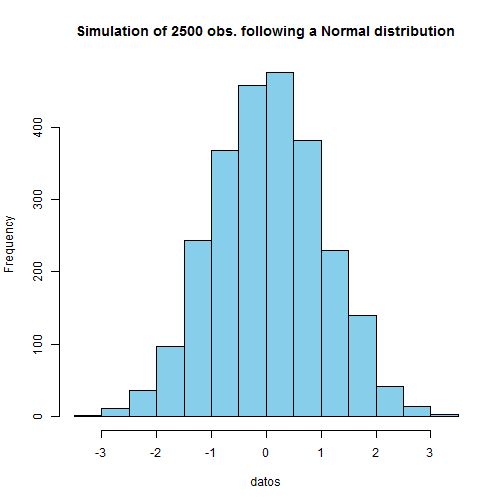
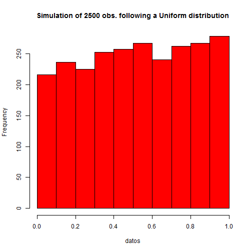
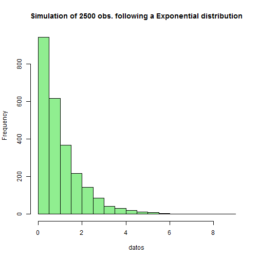

## Description

The [Distribution Simulation APP](http://estebanvar90.shinyapps.io/devel-project/) intends to recreate a simulation of 3 of the most common continious distributions:

- Normal
- Uniform
- Exponential

The app has an interactivity that allows to see the shape of the distribution when the number of observations simulated increases.

In order to reproducible purposes, a different panel is included with the data used to construct the plots.

---

## How to use the App

The application consists of a `sidebarPanel` that has `radiobuttons` that allow the user to select which type of distribution generate numbers from. The following code allow us to do so.


```r
radioButtons("dist", "Distribution type:",
          c("Normal" = "norm",
            "Uniform" = "unif",
            "Exponential" = "exp"))
```

Then, we use a `sliderInput` so the user can manipulate the number of random variables that he wants to generate. The plots change instantly with each change in the slider from 1 to 5000. The code used is the following:


```r
sliderInput("n", 
        "Number of observations:", 
        value = 500,
        min = 1, 
        max = 5000)
```

---
## Plot rendered

The plot depends on the data which comes from n chosen random numbers from the specified distribution, each plot with a different color to avoid confusions, each with a distinctive title. The following code recreates the same plot from the app, but was adjusted so it can be viewed in this presentatios. The code here and the one in the app are very resembling.


```r
myHist<-function(x,distribution){
  if (distribution=="Normal"){
    datos<-rnorm(x);colores<-"skyblue"
    } else if(distribution=="Uniform"){  
    datos<-runif(x);colores<-"red"
    } else if (distribution=="Exponential"){
    datos<-rexp(x);colores<-"lightgreen"
    }  
  hist(datos, main=paste('Simulation of', x, "obs. following a", 
                  distribution,"distribution", sep=' '),
       col=colores)
}
```


---

## Example 1

The next 3 slides show the final plots in the app for 2500 observations.


```r
myHist(2500,"Normal")
```

 

---

## Example 2


```r
myHist(2500,"Uniform")
```

 

---

## Example 3


```r
myHist(2500,"Exponential")
```

 


